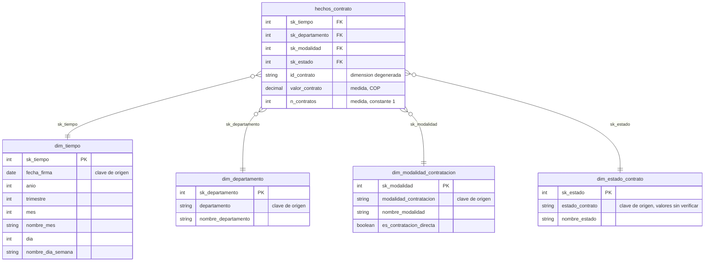
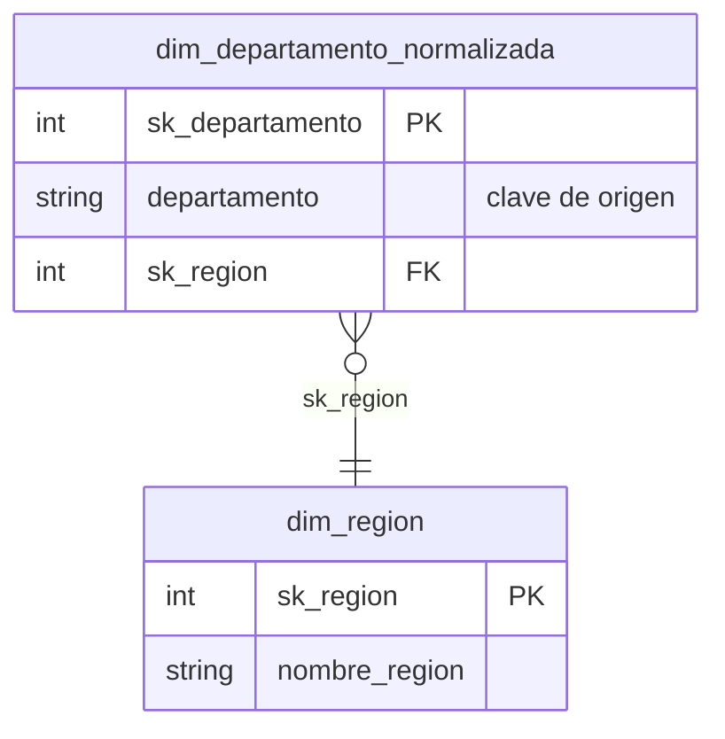

# T10 · Modelo lógico dimensional del proyecto

**Equipo:** Número 6
**Integrantes:** Ana Sofía Henao Torres, Simón Robles Díaz, Samuel Esteban Gómez Alfonso
**Proyecto:** SECOP II — Contratos Electrónicos
**Fecha:** 2026-09-29
**Curso:** IFPN0025 · Big Data e Ingeniería de Datos · Universidad Ean

> El diagrama editable está en `docs/T10_esquema_estrella.drawio`. El bloque Mermaid de la sección 4 es una vista equivalente del mismo esquema, embebida en este documento para que se vea sin abrir draw.io — mismo criterio ya usado en `docs/T8_arquitectura.md` para los diagramas C4.

---

## 0. De dónde sale este modelo

Este modelo **no inventa columnas nuevas**: las claves y atributos de las dimensiones son las columnas reales de `secop_sample_periodo2.csv` que ya se usaron con ejecución verificada en tareas anteriores:

| Columna real | Evidencia de uso ya verificado |
|---|---|
| `id_contrato` | T1: identificador único, 0 duplicados en 44.400 filas (`docs/ficha_tecnica.md`) |
| `fecha_firma` | T5/T6: columna de partición de la capa refinada (`docs/T6_formato.md`) |
| `valor_contrato` | T4: medida agregada por MapReduce, columna 6 (`hdfs-cluster-equipo/EVIDENCIA_T4.md`, sección 4) |
| `departamento` | T4: clave de agrupación real, columna 8, 6 valores distintos en la muestra (`hdfs-cluster-equipo/muestra_t1t3/mapper.py`) |
| `modalidad_contratacion` | T4: clave de agrupación real, columna 3, 5 valores distintos en la muestra (`hdfs-cluster-equipo/muestra_t1t3/mapper3.py`) |
| `estado_contrato` | T6: citada como columna del patrón de consulta típico del equipo (`docs/T6_formato.md`, sección 4) |

La muestra de trabajo tiene 15 columnas; el dataset completo reportado por el portal tiene 85 (T1). Las 9 columnas restantes de la muestra (`descripcion_proceso`, `observaciones` y otras no citadas por nombre en ningún documento anterior) **no se usan aquí como clave ni como medida**, porque ninguna tarea previa verificó su contenido con ejecución real. Esto es lo mismo que T1 ya declaró como pendiente (descargar la fuente propia y repetir las mediciones): este modelo se construye solo sobre lo que el equipo ya verificó, no sobre columnas asumidas.

**Los valores enumerados de `estado_contrato` no están verificados.** A diferencia de `modalidad_contratacion` (5 valores confirmados por conteo real en T4) y `departamento` (6 valores confirmados igual), ningún documento anterior enumeró los valores reales de `estado_contrato` — solo se confirmó que la columna existe y se usa en el patrón de consulta. Queda pendiente verificarlo contra el CSV real antes de construir `dim_estado_contrato` en producción (ver sección 6).

---

## 1. El grano

**Grano:** una fila es un contrato electrónico de SECOP II, identificado por `id_contrato`.

---

## 2. La tabla de hechos

| `hechos_contrato` | Tipo | Descripción |
|---|---|---|
| `sk_tiempo` | Clave foránea | Enlaza con `dim_tiempo`, por la fecha de firma del contrato |
| `sk_departamento` | Clave foránea | Enlaza con `dim_departamento` |
| `sk_modalidad` | Clave foránea | Enlaza con `dim_modalidad_contratacion` |
| `sk_estado` | Clave foránea | Enlaza con `dim_estado_contrato` |
| `id_contrato` | Dimensión degenerada | Identificador del contrato en el sistema origen (T1: único, sin duplicados). No tiene tabla de dimensión propia porque no aporta ningún atributo descriptivo adicional más allá de sí mismo — solo sirve para rastrear una fila de hechos hasta el registro origen (linaje hacia `cruda`/`refinada`, T5/T6) |
| `valor_contrato` | Medida | Monto del contrato, en pesos colombianos (COP) |
| `n_contratos` | Medida | Constante `1` por fila, para poder sumar "número de contratos" en cualquier agregación sin tener que hacer `COUNT(*)` por separado — técnica estándar de Kimball para tablas de hechos transaccionales, no una columna que exista en el CSV origen |

**Por qué estas dos medidas y no más.** `valor_contrato` es la única columna numérica-medida confirmada con ejecución real (T4, agregada por MapReduce). `n_contratos` no es una medida del origen: es una constante derivada, declarada como tal para que quede claro que no proviene del CSV. No se agregó una tercera medida (por ejemplo, un plazo de ejecución en días) porque ninguna columna con ese contenido fue verificada en tareas anteriores — agregarla sería inventar un dato que el equipo no ha confirmado que existe en el archivo real.

---

## 3. Las dimensiones

### `dim_tiempo`
- **Clave subrogada:** `sk_tiempo`
- **Clave de origen conservada como atributo:** `fecha_firma` (fecha calendario real de la columna origen)
- **Atributos:** `anio`, `trimestre`, `mes`, `nombre_mes`, `dia`, `nombre_dia_semana`

Todos los atributos, salvo `fecha_firma` mismo, son derivaciones calendario estándar de esa única columna real (no datos nuevos): ya se usó `fecha_firma` para particionar la capa refinada por `anio`/`mes` en T6 (`src/refinar/convertir_parquet.py`), así que esta dimensión reutiliza exactamente el mismo cálculo, solo que ahora al grano de fila (no de partición de archivo).

### `dim_departamento`
- **Clave subrogada:** `sk_departamento`
- **Clave de origen conservada como atributo:** `departamento` (nombre del departamento, tal como llega en la columna 8 del CSV — no hay un código DANE separado confirmado en la muestra)
- **Atributos:** `nombre_departamento` (igual al valor de origen; no hay más atributos geográficos confirmados en el CSV real — ver sección 5 sobre por qué no se agregó `región` aquí)

### `dim_modalidad_contratacion`
- **Clave subrogada:** `sk_modalidad`
- **Clave de origen conservada como atributo:** `modalidad_contratacion` (columna 3 del CSV)
- **Atributos:** `nombre_modalidad`, `es_contratacion_directa` (booleano, `verdadero` cuando `modalidad_contratacion = "Contratación directa"`)

`es_contratacion_directa` no es un dato nuevo: es un indicador derivado del valor ya confirmado de la propia columna, y existe porque **T7 ya declaró un requisito de negocio real que lo necesita**: R4 (alerta de contratos con monto atípico o de contratación directa, `docs/T7_paradigma.md`) filtra exactamente por esta condición. Tener el indicador precalculado en la dimensión es lo que le permitiría a R4, el día que se implemente, hacer `WHERE es_contratacion_directa` en vez de comparar texto contra `"Contratación directa"` en cada corrida.

### `dim_estado_contrato`
- **Clave subrogada:** `sk_estado`
- **Clave de origen conservada como atributo:** `estado_contrato`
- **Atributos:** `nombre_estado`

Esta es la dimensión con menos evidencia directa del grupo: no se ha ejecutado ningún job ni consulta real que enumere sus valores posibles (ver sección 0). Se incluye porque la columna existe y ya se citó como parte del patrón de consulta del equipo (T6), pero su población real (cuántos estados distintos hay, si son 3 o son 12) queda pendiente de verificar contra el CSV real — no se inventan valores de ejemplo aquí para no repetir el mismo problema que T1 ya declaró con el resto del esquema.

---

## 4. El diagrama del esquema estrella

Archivo editable: [`docs/T10_esquema_estrella.drawio`](T10_esquema_estrella.drawio). Vista equivalente en Mermaid (mismo esquema, mismas claves):

---

## 5. Nivel Frontera — copo de nieve sobre `dim_departamento`

**Dimensión elegida:** `dim_departamento`, normalizándola en `dim_departamento` → `dim_region`, donde cada departamento apunta a una región geográfica de Colombia (Andina, Caribe, Pacífica, Orinoquía, Amazonía, Insular — clasificación geográfica estándar, no un dato que salga del CSV de SECOP II).

**Por qué no conviene aquí.** La muestra de trabajo tiene solo **6 departamentos distintos** (T4, sección 4: Boyacá, Cauca, Cundinamarca, Córdoba, Nariño, Tolima) — todos de la región Andina o Caribe. Normalizar una dimensión de 6 filas para evitarle a cada fila repetir un texto de nombre de región ahorra prácticamente nada de espacio (6 filas de texto duplicado es una cifra irrelevante frente a los cientos de miles de filas de hechos), y sí le agrega al analista un `JOIN` extra en cada consulta que quiera agrupar por región. Es el mismo argumento de costo-beneficio que el equipo ya usó en `docs/adr/0001-almacenamiento.md` para descartar el lakehouse: no pagar la complejidad de una capacidad (aquí, normalización) que el volumen real del proyecto no exige.

**Cuándo sí convendría.** Si el dataset completo (85 columnas, ≈5,9 M filas, T1) resulta tener muchos más departamentos o una jerarquía geográfica más profunda (departamento → región → subregión) con atributos propios de cada nivel que cambian con el tiempo (por ejemplo, un departamento que se reclasifica de región), el copo de nieve evitaría actualizar el nombre de la región en miles de filas de la dimensión plana. Con las 6 filas de la muestra actual, esa razón no aplica — **se documenta el análisis, pero no se adopta**: el esquema de la sección 4 se mantiene plano (estrella pura) en las cuatro dimensiones.

---

## 6. Qué falta para pasar de diseño a implementación

Declarado explícitamente, siguiendo el mismo criterio que T7/T8/T9 ya aplicaron a R4 y a PostgreSQL: **este modelo es diseño lógico, no está poblado**. La capa `consolidada` del lago sigue vacía (`docs/T5_lago.md`, sección 1). Antes de construirlo con datos reales, falta:

1. Descargar la fuente propia y verificar contra ella los valores enumerados de `estado_contrato` (pendiente heredado de T1).
2. Escribir el job de transformación `refinada` → `consolidada` que calcule las claves subrogadas y pueble las cuatro tablas de dimensión y la tabla de hechos, análogo a `src/refinar/convertir_parquet.py` pero para este modelo.
3. Decidir dónde vive físicamente el modelo: Parquet en `consolidada` (coherente con la decisión de T9 de que el lago es el almacenamiento principal) o las tablas de PostgreSQL ya reservadas como capa de servicio (`docs/adr/0001-almacenamiento.md`) — esta decisión no se toma en este documento porque no la exige el criterio de aceptación de T10 (modelo lógico), y el ADR 0001 ya deja ambas rutas abiertas según el uso.

---

## Autoverificación antes de entregar

- [x] El grano se dice en una frase, sin la conjunción "y".
- [x] Toda medida de la tabla de hechos existe al grano declarado (`valor_contrato` es un valor por contrato; `n_contratos` es la constante técnica que hace sumable el conteo de contratos).
- [x] Toda dimensión aplica a cada fila de hechos (todo contrato tiene una fecha de firma, un departamento, una modalidad y un estado).
- [x] Hay al menos tres dimensiones conformadas en esquema estrella (cuatro: tiempo, departamento, modalidad, estado).
- [x] Cada dimensión tiene su clave subrogada, distinta de la clave de origen.
- [x] Ninguna medida quedó en una dimensión, ni ningún atributo descriptivo en los hechos (salvo `id_contrato`, declarado explícitamente como dimensión degenerada, técnica estándar de Kimball, no un descuido).
- [x] El diagrama editable está en el repositorio (`docs/T10_esquema_estrella.drawio`), no solo como imagen.

---

## Declaración de uso de IA generativa

- **Herramienta usada:** Claude (Anthropic), a través de Claude Code.
- **En qué parte:** lectura y consolidación de las columnas reales ya verificadas en T1, T4 y T6; diseño del grano, la tabla de hechos y las cuatro dimensiones a partir de esas columnas (no de datos de ejemplo genéricos); identificación de `es_contratacion_directa` como atributo derivado útil para R4 (ya declarado en T7); redacción del análisis de copo de nieve de la sección 5 y su conclusión de no adopción; construcción del archivo `docs/T10_esquema_estrella.drawio` y del diagrama Mermaid equivalente; y redacción completa de este documento.
- **Qué verifiqué:** que cada columna citada como clave o medida (`id_contrato`, `fecha_firma`, `valor_contrato`, `departamento`, `modalidad_contratacion`, `estado_contrato`) aparece tal cual en el documento fuente indicado entre paréntesis (T1, T4, T6) — ninguna se inventó. Los valores de `modalidad_contratacion` (5) y `departamento` (6) citados en la sección 0 y en el análisis de la sección 5 son los conteos reales de `hdfs-cluster-equipo/EVIDENCIA_T4.md`, sección 4, no estimaciones nuevas.
- **Pendiente por el equipo:** confirmar que el diseño de las cuatro dimensiones y la exclusión de una tercera medida satisface el criterio de aceptación de T10 antes de la entrega; verificar los valores reales de `estado_contrato` contra el CSV propio cuando se descargue (pendiente heredado de T1); y decidir, cuando el curso llegue a la etapa de implementación, si el modelo se puebla en `consolidada` (Parquet) o en PostgreSQL (sección 6).

---

## Referencias

Kimball, R., y Ross, M. (2013). *The data warehouse toolkit: The definitive guide to dimensional modeling* (3.ª ed.). John Wiley & Sons.

Reis, J., y Housley, M. (2022). *Fundamentals of data engineering*. O'Reilly Media.
