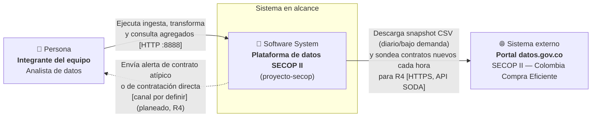
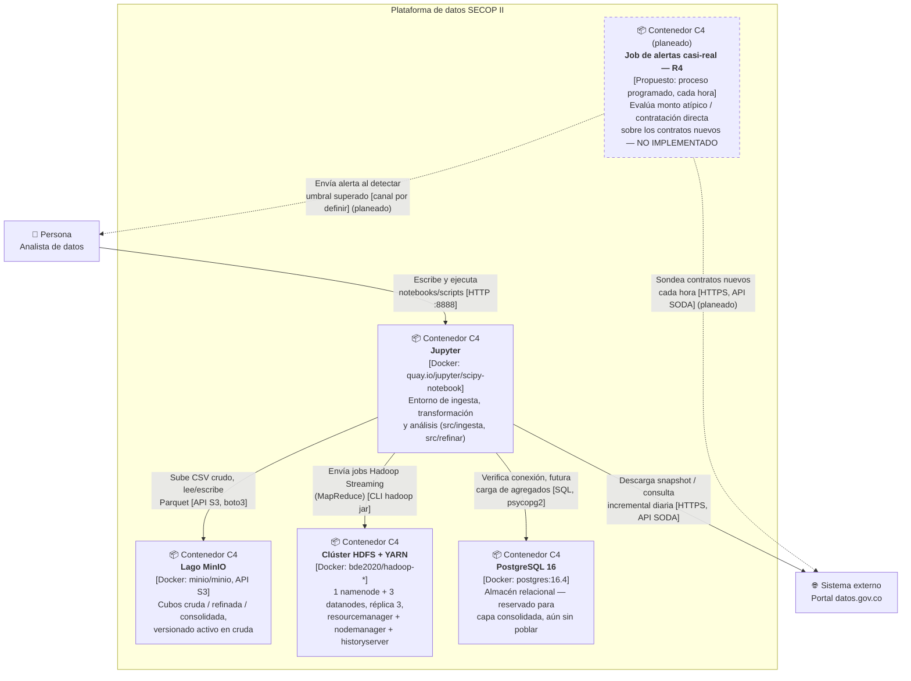

# T8 · Documento de arquitectura del proyecto · Hito A

**Equipo:** Número 6
**Integrantes:** Ana Sofía Henao Torres, Simón Robles Díaz, Samuel Esteban Gómez Alfonso
**Proyecto:** SECOP II — Contratos Electrónicos
**Fecha:** 2026-09-29
**Curso:** IFPN0025 · Big Data e Ingeniería de Datos · Universidad Ean

> Este documento teje T1, T3, T4, T5, T6 y T7 en un solo argumento de arquitectura: qué construimos, con qué paradigma, sobre qué arquitectura de referencia, con qué compromisos técnicos, y cómo se reproduce. No repite las cifras de esas tareas por yuxtaposición — las usa como evidencia para sostener la decisión de la sección 3, que es la novedad real de este documento.

---

## 1. Contexto y fuente de datos

**El sistema.** El equipo construye una plataforma de datos por lotes que ingiere, versiona y transforma el histórico de contratación pública de Colombia, para que un analista pueda calcular agregados de tendencia (por entidad, departamento, modalidad, monto) sobre un lago confiable y trazable, sin depender de descargas manuales repetidas del portal.

**La fuente.** SECOP II — Contratos Electrónicos, publicada por la Agencia Nacional de Contratación Pública (Colombia Compra Eficiente) en datos.gov.co. El portal opera bajo términos generales de uso libre, sin licencia Creative Commons explícita a nivel de dataset. Formato CSV descargable desde la interfaz Socrata, con API SODA disponible para consulta incremental por rango de fechas. El dataset completo reporta ≈5.900.000 filas y 85 columnas (≈4,5 GB estimados, cota inferior); la muestra de trabajo usada para medir (44.400 filas, 15 columnas) crece a una tasa observada de 0,86 % mensual. El portal declara actualización "continua", pero esa frecuencia no ha sido verificada de forma independiente por el equipo (requiere dos descargas propias en fechas distintas, pendiente según la propia ficha técnica de T1).

**Nota heredada, no resuelta en este documento:** T1 deja pendiente reemplazar la muestra de evidencia por una descarga propia del portal antes de la entrega final. Esta arquitectura se diseña sobre las cifras disponibles hoy; si la descarga propia cambia el orden de magnitud del volumen o de `g`, la sección 2 y la proyección de T3 deben revisarse, no solo este documento.

---

## 2. Decisión de paradigma

*(Consolidado de T7 — ver `docs/T7_paradigma.md` para los cuatro supuestos declarados que sostienen esta tabla.)*

| Requisito | Frescura exigida | Volumen por ciclo | Paradigma |
|---|---|---|---|
| R1 · Ingesta cruda del dataset completo al lago | Días | ≈4,5 GB / ≈5,9 M registros por corrida completa | Lotes |
| R2 · Ingesta incremental por rango de fechas (API SODA) | Días | ≈130-155 contratos/día | Lotes |
| R3 · Análisis histórico y agregados de tendencia | Días | Todo el histórico acumulado por corrida | Lotes |
| R4 · Alerta de contratos nuevos con monto atípico o de contratación directa | Horas | ≈5-6 contratos/hora en promedio (extrapolado de T1) | Casi real |

**Paradigma del proyecto:** híbrido, predominantemente por lotes, con un componente casi real acotado a R4. R1-R3 comparten el patrón ya medido en T6 — escritura rara, lectura frecuente — y ninguno tiene un usuario esperando una respuesta en el instante en que el dato se publica en el origen. R4 sí exige frescura de horas (una alerta con un día de rezago ya no sirve como detección temprana), pero se resuelve con sondeo periódico a la API SODA, no con streaming continuo: no hay razón de negocio para exigir segundos (T7, Supuesto 4 y Parte C). **R4 es un requisito de diseño**: no está implementado, no existe job, scheduler ni mecanismo de notificación en el repositorio.

**Consecuencia directa para la sección 3:** existe un requisito con necesidad real de frescura menor a un día, pero acotada a horas — eso es justo lo que decide la arquitectura de la sección 3: ni un pipeline puramente de lotes-diarios-o-más (que dejaría a R4 sin su ventana de detección), ni una arquitectura de streaming continuo (que resolvería una exigencia de segundos que nadie pidió).

---

## 3. Arquitectura de referencia elegida

**Arquitectura elegida: vía única con flujo acotado.** Un solo camino de procesamiento —sin una capa de velocidad paralela tipo Lambda— que sirve las cuatro cadencias decididas en T7: diaria para R2, mensual/bajo demanda para R1 y R3, y **horaria para R4** mediante un sondeo periódico a la API SODA. Las cuatro comparten el mismo lago de tres capas (`cruda` → `refinada` → `consolidada`, T5); lo que cambia entre ellas no es la arquitectura, sino qué tan seguido se ejecuta el mismo tipo de trabajo — de ahí "flujo acotado": el camino es uno solo, pero una de sus ventanas de ejecución es tan corta como una hora.

**Por qué encaja con el paradigma.** La sección 2 concluye que R4 sí exige una frescura menor a un día, pero acotada a horas — ningún requisito exige segundos ni minutos. Una arquitectura Lambda existe para resolver un problema que **no tenemos**: servir vistas de baja latencia (segundos/minutos) mientras una capa de lotes corrige el resultado exacto en segundo plano, típicamente sobre un broker de eventos y un motor de procesamiento en memoria persistente. R4 no necesita nada de eso: un sondeo horario que consulta la API SODA, compara los contratos nuevos contra reglas de umbral (monto atípico o modalidad de contratación directa) y dispara una notificación es, en esencia, el mismo tipo de trabajo por lotes que R1-R3, solo que con una ventana mucho más corta. Adoptar Lambda completo para una exigencia de horas sería sobredimensionado: se pagaría la complejidad de un pipeline de eventos persistente para ganar una ventana de detección de minutos en vez de una hora, algo que ningún requisito real pide (T7, Parte C).

**El costo que aceptamos.** R4, tal como está diseñado, es casi real por sondeo, no por eventos: en el peor caso, un contrato puede tardar hasta una hora en generar alerta, nunca segundos. Si en el futuro aparece un requisito genuino de baja latencia (por ejemplo, si la ventana de una hora resultara insuficiente para un caso de uso real de control interno), esta arquitectura no lo sirve tal cual: habría que añadir una capa de velocidad real, no simplemente acortar el intervalo de sondeo indefinidamente. Aceptamos ese costo de rediseño futuro a cambio de no pagar hoy la complejidad operativa de un pipeline de eventos que el requisito actual de R4 no exige — la misma lógica de costo-beneficio que T3 aplicó al factor de réplica (pagar solo lo que el riesgo o el requisito real exige, no lo que "podría" hacer falta).

**Por qué no la malla de datos.** Data mesh resuelve un problema organizacional: varios dominios de datos, cada uno con su propio equipo productor, que necesitan gobernanza federada y una plataforma de autoservicio para no cuellos de botella en un equipo central. Este proyecto tiene **un solo dominio** (SECOP II) y **un solo equipo de tres personas** que produce y consume el dato. No hay múltiples equipos productores que coordinar, no hay conflicto de propiedad del dato, y no hay demanda de autoservicio entre dominios. Adoptar mesh aquí significaría construir productos de datos federados, contratos de datos entre dominios inexistentes y una plataforma de autoservicio — todo el costo organizacional de mesh, sin ninguno de los problemas que resuelve (Dehghani, 2022).

---

## 4. Diagramas C4

> Ambos diagramas están en Mermaid: el bloque de texto de abajo **es** el archivo editable, versionado en este mismo documento — no hay una imagen aparte que pueda desincronizarse del código fuente del diagrama.

### 4.1 Diagrama de contexto (Nivel 1)

Un único nivel de abstracción: el sistema como caja, sus actores y los sistemas externos con los que intercambia datos. No se muestra nada interno al sistema.

### 4.2 Diagrama de contenedor (Nivel 2)

Un único nivel de abstracción: los contenedores *dentro* de "Plataforma de datos SECOP II". **Nota de notación:** "contenedor" aquí es el término C4 (una unidad de despliegue con su propia tecnología), no un contenedor Docker — aunque en este proyecto cada contenedor C4 sí se implementa como uno o varios contenedores Docker, la equivalencia es coincidencia de esta infraestructura, no una regla de C4.

**Observación voluntaria del equipo, no exigida por la rúbrica.** El diagrama de arriba muestra la arquitectura lógica: cómo se comunican los contenedores C4, sin importar en qué red de Docker corre cada uno hoy. Para quien vaya a reproducir el proyecto, vale aclarar que en la práctica los tres stacks de Docker Compose (raíz, `lago-equipo`, `hdfs-cluster-equipo`) corren como despliegues separados, cada uno en su propia red: Jupyter llega a MinIO por `host.docker.internal:9002` (ver `lago-equipo/EVIDENCIA_T5.md`, sección 0), y el envío de jobs al clúster HDFS/YARN se ha hecho hasta ahora desde la línea de comandos dentro del propio clúster, no automatizado desde Jupyter (ver `hdfs-cluster-equipo/EVIDENCIA_T4.md`, sección "Ausencias y desviaciones"). Unificar los tres stacks en una sola red no es un requisito de T2, T5 ni de esta tarea — es una mejora de comodidad operativa que el equipo puede considerar más adelante si le resulta útil, no una brecha frente al enunciado.

**El contenedor de R4 (con borde punteado en el diagrama) es una propuesta de diseño, no código existente.** No hay hoy ningún proceso programado, ninguna regla de umbral codificada, ningún contenedor Docker ni ningún mecanismo de notificación para R4 en el repositorio. Se documenta aquí porque la sección 3 lo usa para justificar por qué la arquitectura elegida es "vía única con flujo acotado" y no Lambda: implementarlo, cuando llegue esa etapa del curso, requiere solo un job programado (p. ej. un cron dentro del contenedor de Jupyter o un contenedor nuevo y ligero) que reutilice el mismo cliente de la API SODA que ya usará R2 — no un componente de streaming nuevo.

---

## 5. Decisiones y compromisos

| Decisión | Elección | Fundamento |
|---|---|---|
| Almacenamiento y factor de réplica | Factor de réplica 3, bloque HDFS de 128 MB | T3: V₁₂ = 4,987 GB proyectados a 12 meses; pasar de factor 2 a 3 cuesta solo +4,99 GB y tolera 2 nodos caídos simultáneos; dato crítico no regenerable (`docs/proyeccion_almacenamiento.md`, `docs/reto_negocio.md`) |
| Modelo de procesamiento | MapReduce (Hadoop Streaming) con combinador, clave `departamento` / `modalidad_contratacion` | T4: el combinador redujo los bytes de mezcla en >99,9 % (949.538 → 378 bytes en el nivel 1), verificado con contadores reales de YARN sobre el dataset oficial (`hdfs-cluster-equipo/EVIDENCIA_T4.md`, sección 4) |
| Formato y codec | Parquet particionado por `fecha_firma`, codec zstd | T6: 82 % de reducción de tamaño frente a CSV en la muestra, consultas selectivas ≈87 veces más rápidas, costo de escritura marginal frente a gzip (0,138 s vs 2,048 s) (`docs/T6_formato.md`) |
| Compromiso CAP | Consistencia sobre disponibilidad, en la ingesta cruda (R1) | T7: preferible que la ingesta falle de forma explícita a que deje un objeto parcial en `cruda`, del que dependen T6, T3 y R3 (`docs/T7_paradigma.md`, Parte B) |

---

## 6. Reproducibilidad

**El stack.** Tres archivos `docker-compose.yml` independientes: el de la raíz (T2) levanta `db` (PostgreSQL 16.4) y `jupyter` (scipy-notebook, con `src/`, `notebooks/`, `docs/` y `data/` montados); `lago-equipo/docker-compose.yml` (T5) levanta MinIO con la API S3 publicada en el puerto 9002 del host (el 9000 ya lo ocupa el namenode); `hdfs-cluster-equipo/docker-compose.yml` (sesiones 3-4) levanta el clúster HDFS (1 namenode + 3 datanodes, réplica 3) y YARN (resourcemanager, nodemanager construido con Python 3 vía `nodemanager/Dockerfile`, historyserver). Se levantan por separado, en ese orden, según el problema que se quiera reproducir.

**La organización del lago.** Tres cubos en MinIO — `cruda`, `refinada`, `consolidada` — con la convención de ruta `<capa>/<fuente>/anio=YYYY/mes=MM/dia=DD/<archivo>` para `cruda` y `refinada` (partición por fecha de extracción del snapshot, no por fecha de fila) y `consolidada/<pregunta_de_negocio>/anio=YYYY/parte-*.parquet` para lo ya agregado. Versionado activo en `cruda`, verificado con una sobrescritura real y su recuperación por `VersionId` (`docs/T5_lago.md`, `lago-equipo/EVIDENCIA_T5.md`).

**El repositorio.** https://github.com/sofiihenaotorress2007-a11y/proyecto-secop

---

## 7. Referencias

Brewer, E. A. (2012). CAP twelve years later: How the "rules" have changed. *Computer, 45*(2), 23-29. https://doi.org/10.1109/MC.2012.37

Brown, S. (n.d.). *The C4 model for visualising software architecture*. Recuperado el 29 de septiembre de 2026, de https://c4model.com/

Dehghani, Z. (2022). *Data mesh: Delivering data-driven value at scale*. O'Reilly Media.

Kleppmann, M. (2017). *Designing data-intensive applications*. O'Reilly Media.

Reis, J., y Housley, M. (2022). *Fundamentals of data engineering*. O'Reilly Media.

---

## Declaración de uso de IA generativa

- **Herramienta usada:** Claude (Anthropic), a través de Claude Code.
- **En qué parte:** lectura y consolidación de las cifras y decisiones ya documentadas en T1, T3, T4, T5, T6 y T7; razonamiento y redacción de la decisión de arquitectura de la sección 3 (vía única con flujo acotado, en vez de Lambda o malla de datos), derivada del paradigma híbrido que T7 establece; diseño de los dos diagramas C4 en Mermaid; y redacción completa de este documento.
- **Actualización posterior:** a petición del equipo, se revisó si la rúbrica de T8 exige un requisito genuino de flujo o casi-real (la plantilla ofrece "lotes / flujo / casi real" como opciones y "Lambda modesta" como arquitectura posible, lo que sugiere que se espera al menos un caso que no sea lotes puro). Se agregó **R4 · alerta de contratos nuevos con monto atípico o de contratación directa**, con sondeo horario a la API SODA, como requisito de diseño explícito — no implementado — y se actualizaron de forma coherente T7 (tabla de Parte A, Parte C y Supuestos 2 y 4) y esta sección 3 y los diagramas de la sección 4. El volumen de R4 (≈5-6 contratos/hora) es una extrapolación aritmética de la cifra diaria ya medida en T1 (≈130-155 contratos/día), no una medición nueva.
- **Qué verifiqué:** que cada cifra citada en las secciones 1, 2 y 5 existe tal cual en el documento fuente indicado entre paréntesis (T1, T3, T4, T6, T7) — no se recalculó ni se reescaló ningún número para este documento, salvo la extrapolación horaria de R4, declarada como tal. Los diagramas C4 se revisaron contra las reglas de notación declaradas en la plantilla del enunciado (un nivel de abstracción por diagrama, flechas con etiqueta y dirección, contenedor C4 distinto de contenedor Docker); el contenedor de R4 se marcó explícitamente como planeado (borde punteado y texto "NO IMPLEMENTADO") para no dar a entender que ya existe. También releí la plantilla del enunciado para confirmar que no exige integrar los tres stacks de Docker Compose en una sola red — solo pide, en la sección 6, lo que ya documenta T2 (el `docker-compose.yml` de la raíz); la nota sobre los stacks separados en la sección 4 es una aclaración voluntaria de reproducibilidad, no una brecha frente al enunciado. **Pendiente de verificar por el equipo:** que el equipo confirme que R4, como requisito de diseño no implementado, satisface el criterio de la rúbrica antes de la entrega final.

---

## Autoverificación antes de entregar

- [x] La arquitectura elegida se deriva de forma explícita del paradigma de la sección 2.
- [x] Se nombra el costo que se acepta y se descarta la malla con argumento.
- [x] Los dos diagramas C4 respetan las reglas de notación y no confunden el contenedor con Docker.
- [x] Las siete secciones se tejen en un argumento, no se yuxtaponen.
- [x] Cada decisión de la sección 5 tiene su medición o cálculo de respaldo.
- [x] La redacción es clara, el glosario está alimentado (`docs/glosario.md`) y las fuentes se citan en APA 7.
- [x] Los diagramas editables están en el repositorio (bloques Mermaid en este mismo archivo), no solo como imagen.
- [ ] **Pendiente por el equipo:** confirmar que R4, declarado como requisito de diseño no implementado, satisface el criterio de la rúbrica sobre flujo/casi-real — si se exige evidencia de ejecución real (no solo diseño), R4 tendría que construirse antes de la entrega final.
